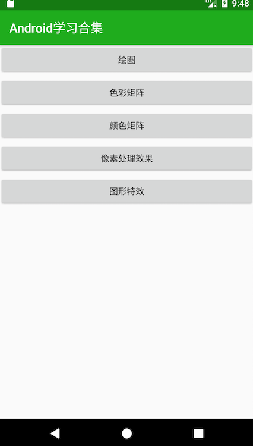
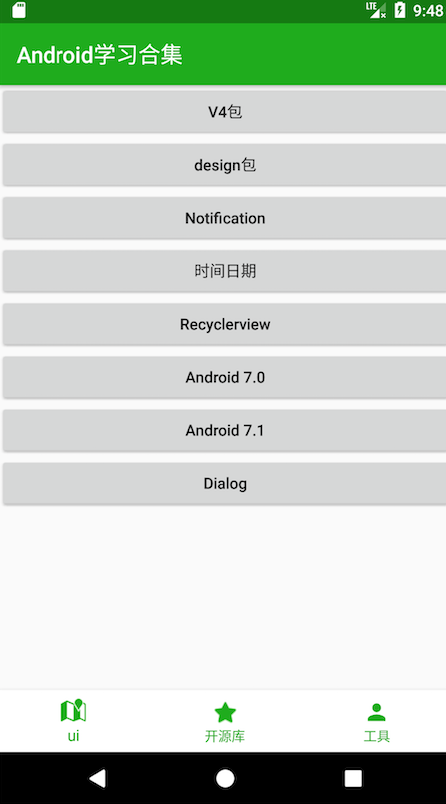

# Android知识学习

Android下一些新的控件和类的使用,主要有

* Collapsing ToolbarLayout
* CoordinatorLayout
* TabLayout
* Palette
* TextInputLayout
* Toolbar
* FloatingBar
* SnackBar
* TimePickerDialog DatePickDialog
* DiffUtil
* BottomNavigatorView
* ItemTouchHelper
* Behavior
* BottomSheetBehavior
* 绘图 图像处理

  

  

  

  

# 开源库

## RxJava

* [RxJava](https://github.com/ReactiveX/RxJava)
* [RxAndroid](https://github.com/ReactiveX/RxAndroid)
* [RxLifecycle](https://github.com/trello/RxLifecycle)
* [RxBinding](https://github.com/JakeWharton/RxBinding)

## 网络

* [retrofit2](https://github.com/square/retrofit)
* [okhttp](https://github.com/square/okhttp)

## 注解

* [ButterKnife](https://github.com/JakeWharton/butterknife)
* [dagger2](https://github.com/google/dagger)

## 图片视频

* [Glide](https://github.com/bumptech/glide)
* [glide-transformations](https://github.com/wasabeef/glide-transformations)
* [PhotoView](https://github.com/chrisbanes/PhotoView)

## 日志

* [logger](https://github.com/orhanobut/logger)

## Json

* [Gson](https://github.com/google/gson)

## ORM

* [GreenDao](https://github.com/greenrobot/greenDAO)

## 路由

* [ARouter](https://github.com/alibaba/ARouter)

## 架构

* [android-architecture-components](https://github.com/googlesamples/android-architecture-components)

## 工具

* [AndroidUtilCode](https://github.com/Blankj/AndroidUtilCode)
* [StatusBarUtil](https://github.com/laobie/StatusBarUtil)
